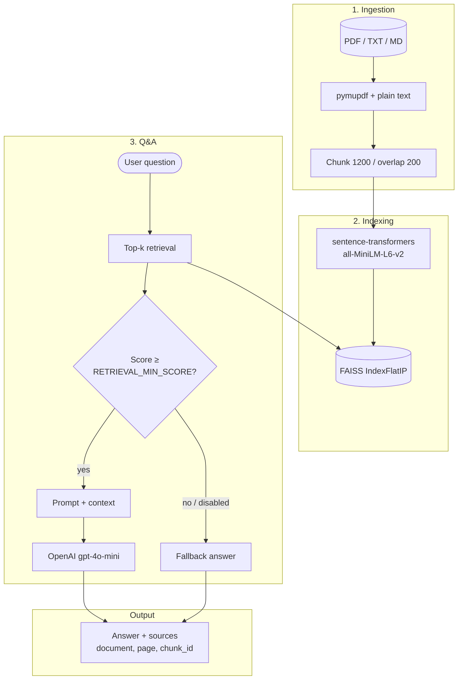

# System architecture (RAG Document QA)

The diagram below can be viewed in GitHub / VS Code Mermaid preview.

## Retrieval → LLM flow (summary)

| Step | Component |
|------|-----------|
| Embed query | `embed_chunks.embed_texts` |
| Search | FAISS inner product (~cosine) |
| Threshold | `.env` → `RETRIEVAL_MIN_SCORE` (optional) |
| Generation | `prompt_builder` + `answer_generator` |
